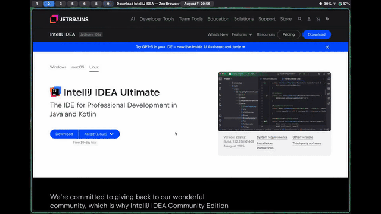

> UPDATE:  
> I've configured RSS now! :D Feel free to add this to your feed. As you can figure out from the infrequency of this, I won't be flooding it.  
> (Copy <a href="https://desyncd.xyz/blog/rss.rss">this</a> link and add it to your reader of choice)

I won't bore you with an introduction, here are words:

## 0. Prerequisites
Most guides for mod development say that you need to know Java to be able to make a mod. Really, you just need to be competent at using computers and have some experience in any programming language. That usually does the trick.

Other things you'll need include:

- A computer running Windows, MacOS, or Linux with good enough specs to run Minecraft: Java Edition
- An internet connection
- The willpower to figure things out for yourself and solve problems as they arise
- A copy of Minecraft: Java Edition (optional)

## 1. Installing IntelliJ IDEA (Optional)
Go to [this](https://jetbrains.com/intellij/download) link and **scroll down and select "IntelliJ IDEA Community Edition"**. The reason we're using this editor instead of something off the shelf (Like `Neovim` or `VSCod(e|ium)`) is because this editor has many important features of Java development builtin. While you don't _need_ this editor, it's recommended. Of course, I get it if you choose not to use it. I love my vim motions too.

> If you're on Linux, install it with your package manager of choice. If it isn't there, you can of course follow the instructions.

 

Click through the installation guide, and once you're in the editor, **go to the plugins tab and search for "Minecraft Development". Install it and click "Restart IDE" when prompted.**

Congratulations! You've now installed the code editor you'll be using for creating all of your mods.

## 2. Creating the Project
#### 2.1 If you aren't using IntelliJ

(There's also a GitHub template if you so desire)
Go to [this](https://fabricmc.net/develop/template/) website and fill it out. Your package name is just a domain name backwards, such as `com.example` or `xyz.desyncd`. If you don't have a domain name, pick something like `me.john` It doesn't matter as long as it's unique to your mods. It doesn't actually matter. Under advanced options, optionally enable Kotlin if you prefer that programming language, and Data Generation if you'd like an easier time managing things like recipes and loot tables. If that doesn't seem important to you, leave this unticked.

Download your template, unzip it, and open it in your editor of choice.
#### 2.2 If you are using IntelliJ

Hit "New Project" and on the left select the "Minecraft" tab. This is a Fabric tutorial, so select "Fabric". Fill out the rest of the options. Your group ID is just a domain name backwards, such as `com.example` or `xyz.desyncd`. If you don't have a domain name, pick something like `me.john`. It doesn't matter as long as it's unique to your mods. Optionally, enable Kotlin if you prefer that programming language, and Data Generation if you'd like an easier time managing things like recipes and loot tables. If that doesn't seem important to you, disable this.

> If you choose to use Kotlin, note that you're forgoing most of the community support you'd get otherwise. Some library mods may not work. (e.g owo-lib)

## 3. Configuring and Understanding your Project
This was 
